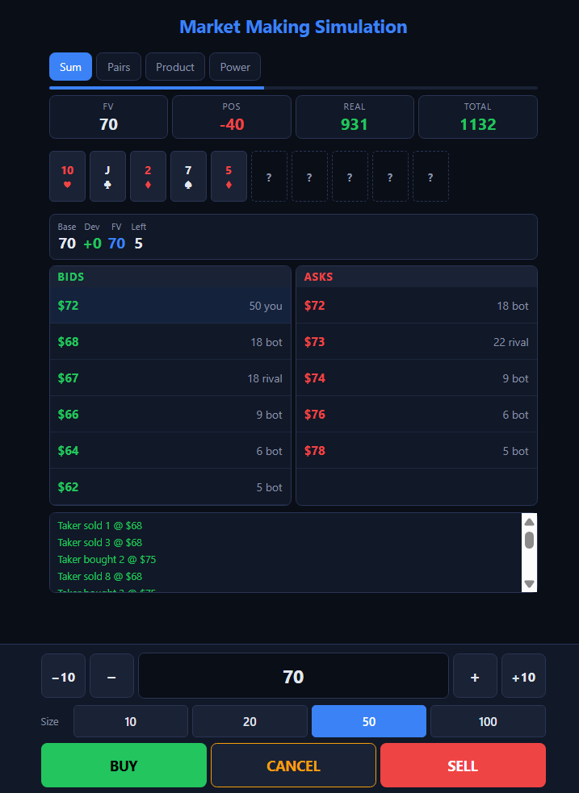

# Market Making Simulation

A mobile-friendly practice tool for trading competition market making games. Built for the Trading at Georgia Tech intercollegiate competition format.

## Play Now

Just open `index.html` in your browser. No install needed. Works on iPhone/Android.

**[Live Demo](https://yourusername.github.io/market-making-simulation/)** ← update this after deploying

## Game Modes

| Mode | Contract | Key Skill |
|---|---|---|
| **Sum** | Sum of N card values (A=1..K=13) | Deviation method: start N×7, add (card−7) per reveal |
| **Pairs** | nC2 pairs per rank × 100 | Track rank frequencies, duplicates = exponential value |
| **Product** | Multiply suit values (♣1 ♦2 ♥3 ♠4) × 10 | Clubs kill value, spades explode it |
| **Power** | 2^(red card count) | Exponential payoff, each red doubles |

## How It Works

You're a market maker. Post buy and sell orders around fair value. The taker bot fills your orders (your income). The adverse bot punishes bad prices (your risk).

**Core loop after each card reveal:**
1. **CANCEL** all orders
2. Adjust price to new fair value **−3** → **BUY**
3. Adjust price to new fair value **+3** → **SELL**
4. Wait for taker bot to fill you

## Features

- 📱 Mobile-optimized with sticky bottom trading panel
- ⚡ Adjustable reveal speed (8-25 seconds)
- 🎯 Three difficulty levels (Easy/Normal/Hard)
- 📊 Round review with coaching grades (A-F)
- 🤖 Taker bot (rewards good market making)
- ⚠️ Adverse bot (punishes mispriced orders)
- 👥 Rival traders with stale orders to snipe

## Scoring Grades

| Grade | Meaning |
|---|---|
| **Discipline** | Were you hit by the adverse bot? |
| **Taker** | How many fills did the taker bot give you? |
| **Uptime** | How many seconds was your book empty? |
| **P&L** | Final profit and loss |

## Deploy to GitHub Pages

1. Fork this repo
2. Go to Settings → Pages
3. Set source to `main` branch, root folder
4. Your site is live at `https://yourusername.github.io/market-making-simulation/`

## Based On

Trading at Georgia Tech 2nd Annual Intercollegiate Trading Competition (March 2026). Game mechanics include market making with card-based contract valuation, taker bots, and adverse selection bots.

## License

MIT — use it, share it, improve it.
